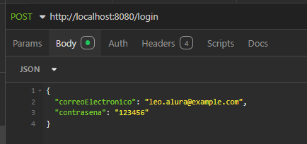
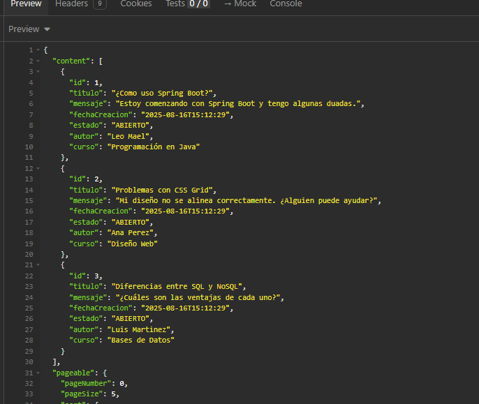

<h1 align="center">
  Challenge Foro HUD API
</h1>

<div align="center" style="flex">

  [](https://www.oracle.com/java/) [](https://spring.io/projects/spring-boot) [](https://www.mysql.com/) [](https://jwt.io/) [](https://github.com)

</div>

<p align="center">
  API REST desarrollada en Java con Spring Boot como parte del Challenge de Alura Latam.
  Su propósito es gestionar un foro, permitiendo operaciones CRUD sobre tópicos, 
  autenticación de usuarios con JWT y protección de endpoints.
</p>

## Tabla de Contenido

- [🚀 Descripción del Proyecto](#-descripción-del-proyecto)
- [🎯 Objetivo](#-objetivo)
- [🛠️ Tecnologías Utilizadas](#️-tecnologías-utilizadas)
- [📂 Estructura del Proyecto](#-estructura-del-proyecto)
- [⚙️ Configuración y Ejecución](#️-configuración-y-ejecución)
- [🔐 Autenticación](#-autenticación)
- [📬 Endpoints Principales](#-endpoints-principales)
- [📌 Estado del Proyecto](#-estado-del-proyecto)
- [👤 Autor](#-autor)

## 🚀 Descripción del Proyecto

Este proyecto es una API RESTful construida con Java 21 y el framework Spring Boot. Su función principal es administrar la información de un foro en línea, permitiendo la gestión de tópicos mediante operaciones CRUD (Crear, Leer, Actualizar, Eliminar).  
Incluye autenticación con JWT y configuración de seguridad con Spring Security.

## 🎯 Objetivo

Proveer una base sólida para el desarrollo de un foro que permita:

- Creación de nuevos tópicos de discusión.
- Listado y visualización de tópicos existentes.
- Edición y eliminación de tópicos por usuarios autenticados.
- Protección de endpoints mediante autenticación JWT.

Este proyecto fue desarrollado como parte del **Challenge Java Spring de Alura Latam**.


## 🛠️ Tecnologías Utilizadas

- [Java 21](https://www.oracle.com/java/technologies/javase/jdk21-archive-downloads.html)
- [Spring Boot 3.5.4](https://spring.io/projects/spring-boot)
- [Spring Security](https://spring.io/projects/spring-security)
- [JWT (JSON Web Token)](https://jwt.io/)
- [MySQL](https://www.mysql.com/)
- [Maven](https://maven.apache.org/)
- [Flyway](https://flywaydb.org/)
- [JPA / Hibernate](https://hibernate.org/)
- [Lombok](https://projectlombok.org/)
- [Swagger / SpringDoc (pendiente)](https://springdoc.org/)
- [JUnit / Mockito (pendiente)]


## 📂 Estructura del Proyecto

```
src/main/
│
├── java/com/leo/challenge_foro_hud/
│ ├── ChallengeForoHudApplication.java
│ ├── controller/ # Controladores REST
│ ├── domain/ # Entidades, DTOs y repositorios
│ ├── infra/
│ │ ├── errores/ # Manejadores de excepciones
│ │ ├── security/ # Seguridad y JWT
│ │ └── springdoc/ # (Pendiente) Documentación Swagger
│
└── resources/
├── application.properties # Configuración del proyecto
└── db/migration/ # Scripts de migración Flyway
```

## ⚙️ Configuración y Ejecución

### 📄 Variables de entorno (`application.properties`)

```properties
spring.application.name=challenge_foro_hud
spring.datasource.url=jdbc:mysql://localhost/foro_hud
spring.datasource.username=${DB_USER}
spring.datasource.password=${DB_PASSWORD}
spring.jpa.show-sql=false
spring.jpa.properties.hibernate.format_sql=true
server.error.include-stacktrace=never
api.security.secret=${JWT_SECRET:leo_challenge_foro_hud}
```


### 🔐 Autenticación

La API utiliza JWT para autenticación. Debes:

1. Hacer una petición POST /login con las credenciales.
2. Recibir un token JWT en la respuesta.
3. Usar el token en el encabezado Authorization: Bearer {token} para las peticiones protegidas.

Ejemplo de body JSON para `/login`:

```json
{
  "correoElectronico": "leo.alura@example.com",
  "contrasena": "123456"
}
```


### 📬 Endpoints Principales (resumen)

| Método | Endpoint | Descripción | Auth | Roles |
|--------|----------|-------------|------|-------|
| `POST` | `/login` | Iniciar sesion | ❌ | USER |
| `GET` | `/topicos` | Listar tópicos (paginado) | ✅ | USER |
| `GET` | `/topicos/{id}` | Obtener tópico por ID | ✅ | USER |
| `POST` | `/topicos` | Crear nuevo tópico | ✅ | USER |
| `PUT` | `/topicos/{id}` | Actualizar tópico | ✅ | USER |
| `DELETE` | `/topicos/{id}` | Eliminar tópico | ✅ | USER |


- Ejemplo de `/login`:


- luego hacer `/topicos`


```json
{
	"content": [
		{
			"id": 1,
			"titulo": "¿Como uso Spring Boot?",
			"mensaje": "Estoy comenzando con Spring Boot y tengo algunas duadas.",
			"fechaCreacion": "2025-08-16T15:12:29",
			"estado": "ABIERTO",
			"autor": "Leo Mael",
			"curso": "Programación en Java"
		},
		{
			"id": 2,
			"titulo": "Problemas con CSS Grid",
			"mensaje": "Mi diseño no se alinea correctamente. ¿Alguien puede ayudar?",
			"fechaCreacion": "2025-08-16T15:12:29",
			"estado": "ABIERTO",
			"autor": "Ana Perez",
			"curso": "Diseño Web"
		},
		{
			"id": 3,
			"titulo": "Diferencias entre SQL y NoSQL",
			"mensaje": "¿Cuáles son las ventajas de cada uno?",
			"fechaCreacion": "2025-08-16T15:12:29",
			"estado": "ABIERTO",
			"autor": "Luis Martinez",
			"curso": "Bases de Datos"
		}
	],
	"pageable": {
		"pageNumber": 0,
		"pageSize": 5,
		"sort": {
			"empty": true,
			"sorted": false,
			"unsorted": true
		},
		"offset": 0,
		"unpaged": false,
		"paged": true
	},
	"last": true,
	"totalElements": 3,
	"totalPages": 1,
	"size": 5,
	"number": 0,
	"sort": {
		"empty": true,
		"sorted": false,
		"unsorted": true
	},
	"numberOfElements": 3,
	"first": true,
	"empty": false
}
```

## Estado del Proyecto

✅ Proyecto terminado con las funcionalidades principales del CRUD y autenticación implementadas.

🔜 Próximos pasos:

- Agregar documentación Swagger.
- Añadir tests con JUnit y Mockito.
- Expandir funcionalidades (respuestas, usuarios, categorías, etc.).

## Agradecimientos

- [Alura Latam](https://www.aluracursos.com/) - Por el challenge y la formación

